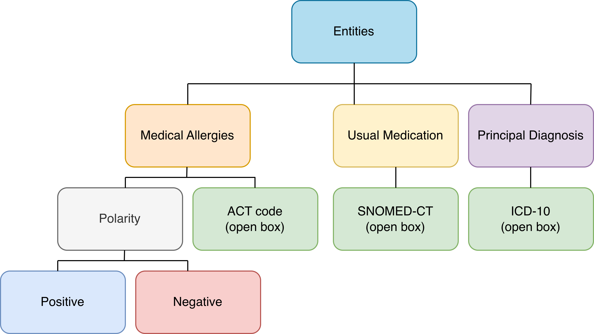

# Portuguese Emergency Room Clinical NER

**Dataset, models, and baselines for extracting diagnoses, medication allergies, and usual medications from Portuguese ER admission notes.**

This repository accompanies the paper *"NER Models for Portuguese Emergency Room Notes: Extracting Diagnoses, Medication Allergies, and Usual Medications"* and contains everything needed to reproduce the experiments: the annotated dataset, fine-tuning and evaluation scripts for encoder models, generative LLM baselines, prompts, and pre-computed results.

> **Clinical use disclaimer:** The clinical notes in this dataset are fictional or synthetic and are intended for research and benchmarking only. The models and scripts are **not** validated for direct clinical use. Deployment in any clinical workflow requires institutional approval, data-governance review, and prospective clinical validation.

---

## Overview

Emergency Room (ER) handovers require rapid identification of a patient's principal diagnosis, usual medications, and medication allergies. This project develops and evaluates specialised NER models for these three entities in Portuguese, a language underrepresented in clinical NLP resources.

**Key contributions:**

- A **synthetic dataset** of 300 Portuguese ER admission notes (275 LLM-generated with Llama 3.3 + 15 physician-validated), covering eight medical specialties.
- **Two-layer annotation**: entity spans for the three target classes, plus mappings to standard terminologies (ICD-10 for diagnoses, ATC for medication allergies, SNOMED CT for usual medications).
- **Fine-tuned NER models**: BioBERT-PT and MediAlbertina, benchmarked against few-shot Gemini and Gemma baselines.

### Results summary (macro F1 on physician-validated test set)

| Model | Exact match | IoU ≥ 0.50 |
|---|:---:|:---:|
| BioBERT-PT | **0.75** | **0.82** |
| MediAlbertina | 0.70 | 0.80 |
| Gemma 4 (open-weight) | 0.48 | 0.63 |
| Gemini 2.5 Flash Lite (closed-weight) | 0.35 | 0.44 |

Encoder models substantially outperform generative baselines. Principal diagnosis is the most challenging class; usual medication extraction achieves the strongest performance across all models.

---

## Repository structure

```
ER_NER/
├── dataset/
│   ├── train.json                             # 257 documents — NER training split (spans + polarity)
│   ├── val.json                               # 28 documents  — NER validation split (spans + polarity)
│   ├── test-real.json                         # 15 documents  — physician-validated evaluation split
│   ├── dataset_with_codes.json                # All 300 documents with terminology codes (ICD-10, ATC, SNOMED CT)
│   └── ER_NER_Dataset_Characterization.ipynb  # Dataset statistics and analysis
│
├── encoders_training_testing/
│   ├── train.py                               # Fine-tuning script (HuggingFace Transformers)
│   ├── train-run.sh                           # Training launcher with hyperparameter config
│   ├── test-per-class.py                      # Evaluation script (exact match + IoU@0.5)
│   ├── test_sub.sh                            # Evaluation launcher
│   └── additional_details.md                 # Full training and evaluation details
│
├── generative_testing/
│   ├── ER_NER_baseline__cleaned.ipynb         # Gemini / Gemma few-shot NER extraction
│   └── ER_NER_evaluation.ipynb               # Evaluation of generative model outputs
│
├── prompts/
│   ├── prompt_synthetic_data_gen.md           # Prompt template used to generate clinical notes
│   └── prompt_generative_NER_extraction.md   # Prompt template used for generative NER baselines
│
├── results/
│   ├── biobertpt.json                         # BioBERT-PT predictions on test set
│   ├── medialbertina.json                     # MediAlbertina predictions on test set
│   ├── gemini-2.5-flash-lite/                 # Per-document Gemini predictions (JSON + HTML)
│   └── gemma-4-31b-it/                        # Per-document Gemma predictions (JSON + HTML)
│
├── images/
│   ├── annotation_scheme.png
│   ├── dataset_split_count.png
│   ├── annotation_example_diagnosis.png
│   └── usualmedication+medicationallergies_example.png
│
└── README.md
```

---

## Dataset

### Two versions

The dataset is released in two complementary versions, suited to different use cases:

| File | Documents | Content | Use case |
|---|:---:|---|---|
| `train.json` / `val.json` / `test-real.json` | 257 / 28 / 15 | Entity spans and polarity only | NER model training and evaluation |
| `dataset_with_codes.json` | 300 | Entity spans + ICD-10, ATC, and SNOMED CT codes | Normalisation, interoperability, downstream tasks |

### Splits

| Split | File | Documents | Annotated spans |
|---|---|:---:|:---:|
| Train | `train.json` | 257 | 1,493 |
| Validation | `val.json` | 28 | 166 |
| Test | `test-real.json` | 15 | 86 |

The train/validation split uses iterative multi-label stratification to ensure proportional class representation. The test set is composed exclusively of the 15 physician-validated notes, providing a close-to-real-world evaluation benchmark.

### Annotation scheme and terminology mappings



| Entity | JSON label | Terminology | Field in `dataset_with_codes.json` |
|---|---|---|---|
| Principal diagnosis | `Diagnóstico` | ICD-10 | `ICD10` |
| Usual medication | `Medicação Habitual` | SNOMED CT | `SNOMEDCT` |
| Medication allergy | `Alergias medicamentosas` | ATC | `ATC` |

Medication allergies also carry a `Polaridade` field (`Positiva` / `Negativa`) in both dataset versions.

### JSON formats

**NER splits** (`train.json`, `val.json`, `test-real.json`) — spans and polarity only:

```json
{
  "doc_id": 1,
  "text": "...",
  "annotations": [
    {
      "begin": 924,
      "end": 942,
      "label": "Medicação Habitual"
    },
    {
      "begin": 310,
      "end": 319,
      "label": "Alergias medicamentosas",
      "Polaridade": "Positiva"
    }
  ]
}
```

**Full dataset with codes** (`dataset_with_codes.json`) — spans and terminology codes:

```json
{
  "doc_id": 1,
  "text": "...",
  "annotations": [
    {
      "begin": 924,
      "end": 942,
      "label": "Medicação Habitual",
      "SNOMEDCT": "376701008",
      "ATC": "",
      "ICD10": ""
    },
    {
      "begin": 310,
      "end": 319,
      "label": "Alergias medicamentosas",
      "Polaridade": "Positiva",
      "SNOMEDCT": "",
      "ATC": "J01CA04",
      "ICD10": ""
    }
  ]
}
```

The `begin` and `end` fields are **character-level, exclusive-end offsets** into `text`. Recover the span text with:

```python
span = document["text"][annotation["begin"]:annotation["end"]]
```

Each annotation only populates the terminology field relevant to its entity type; the other code fields are empty strings.

### Annotation notes

- **Medication allergies:** the annotated markable is the allergenic agent itself (e.g. `"penicillin"` in *"reports a known allergy to penicillin"*). For negated contexts (e.g. *"has no drug allergies"*), the markable is the negated phrase (e.g. `"drug allergies"`) with `Polaridade = Negativa`.
- **Principal diagnosis:** the most specific ICD-10 code is assigned where possible. Overly generic descriptions (e.g. *"cardiovascular disease"*) are not coded.
- **Usual medication:** spans include the medication name plus dosage and administration instructions when present.

---

## Models

The task is formulated as **BIO sequence labelling** over four effective classes:

| BIO class | Description |
|---|---|
| `Alergias medicamentosas__Positiva` | Positive medication allergy |
| `Alergias medicamentosas__Negativa` | Explicit absence of medication allergy |
| `Medicação Habitual` | Usual/chronic medication |
| `Diagnóstico` | Principal diagnosis |

This yields **9 output labels**: `O` plus `B-` and `I-` for each of the four classes.

Two base models are supported:

| Model | HuggingFace identifier |
|---|---|
| MediAlbertina | `portugueseNLP/medialbertina_pt-pt_900m` |
| BioBERT-PT | `pucpr/biobertpt-all` |

### Training

Configure paths and hyperparameters in `encoders_training_testing/train-run.sh`, then run:

```bash
cd encoders_training_testing
bash train-run.sh
```

**Handling long documents:** notes are split into overlapping 512-token windows with a stride of 128. At inference, logit scores from overlapping windows are averaged per token before argmax decoding.

**Handling class imbalance:** inverse-frequency class weights are applied to the cross-entropy loss (O-class weight capped at 0.25× mean non-O weight; I-X weights forced equal to corresponding B-X weights). Documents containing at least one `Alergias medicamentosas__Negativa` span are oversampled ×4 during training.

The best checkpoint (by validation F1) is saved to `{OUTPUT_DIR}/best/`. See [`encoders_training_testing/additional_details.md`](encoders_training_testing/additional_details.md) for the complete training specification.

### Evaluation

```bash
cd encoders_training_testing
python test-per-class.py \
  --model_dir {OUTPUT_DIR}/best \
  --test_json ../dataset/test-real.json \
  --max_len 512 \
  --stride 128 \
  --score_mode joint \
  --pred_json predictions.json
```

Two span matching criteria are reported:

- **Exact match:** predicted and gold spans must have identical character-level start and end indices.
- **Relaxed match (IoU ≥ 0.50):** the character-level overlap between predicted and gold spans must meet a minimum intersection-over-union threshold of 50%.

Evaluation runs in **joint extraction + polarity** mode (`--score_mode joint`): missed and spurious spans are penalised in addition to polarity errors.

---

## Generative baselines

Few-shot generative NER experiments are in `generative_testing/ER_NER_baseline__cleaned.ipynb`. Both baselines use [LangExtract](https://github.com/google/langextract) to obtain structured outputs.

For each test document, the most semantically similar training document (by cosine similarity of text embeddings) is retrieved and used as a dynamic few-shot example.

| Model | Type | Identifier |
|---|---|---|
| Gemini 2.5 Flash Lite | Closed-weight (API) | `gemini-2.5-flash-lite` |
| Gemma 4 | Open-weight (local) | `gemma-4-31B-it` |

> **Privacy note:** closed-weight API models are unsuitable for real ER settings due to data governance constraints. Open-weight models can be deployed locally within hospital infrastructure.

Pre-computed per-document predictions are available in `results/gemini-2.5-flash-lite/` and `results/gemma-4-31b-it/`.

---

## Prompts

| File | Purpose |
|---|---|
| `prompts/prompt_synthetic_data_gen.md` | Template used with Llama 3.3 to generate synthetic clinical notes. Parameterised by `{medical specialty}` and `{allergy}` (presence/absence), with a physician-validated note as `{example}`. |
| `prompts/prompt_generative_NER_extraction.md` | Extraction prompt for the generative baselines, defining the three entity classes and extraction rules. |

---

## Dataset construction

1. Five physicians from four specialties each wrote one fictional ER admission note.
2. Fifteen variations were generated from these examples using the synthetic data generation prompt, then reviewed and validated by the same physicians.
3. 275 additional notes were generated using Llama 3.3, with the 15 validated notes as few-shot examples. Medical specialty and allergy presence/absence were varied systematically across generations.
4. The resulting 275 synthetic notes were combined with the 15 physician-validated notes for annotation.

**Quality evaluation:** two independent physicians assessed 60 synthetic notes each using a six-question Likert protocol. The notes scored positively on medication clarity (Q2) and allergy identification (Q5), with moderate scores on diagnosis specificity (Q4). See the paper for the full evaluation results and inter-annotator agreement (Krippendorff's α).

**Annotation** was performed by a PhD student in Linguistics with a pharmaceutical background, using a layered approach (markables → allergy codes → diagnosis codes → medication codes).

---

## Citation

If you use this dataset, models, or code in your work, please cite:

```bibtex
@inproceedings{ernermodels2026,
  title     = {NER Models for Portuguese Emergency Room Notes: Extracting Diagnoses, Medication Allergies, and Usual Medications},
  author    = {Anonymous},
  booktitle = {Anonymous Submission},
  year      = {2026}
}
```

*This entry will be updated with the full citation upon publication.*

---

## License

## Licence

- **Dataset** (`dataset/`): [CC BY-NC 4.0](LICENSE-DATASET.txt) — free for research; commercial use requires permission.
- **Code** (`encoders_training_testing/`, `generative_testing/`, `prompts/`): [Apache 2.0](LICENSE-CODE.txt).